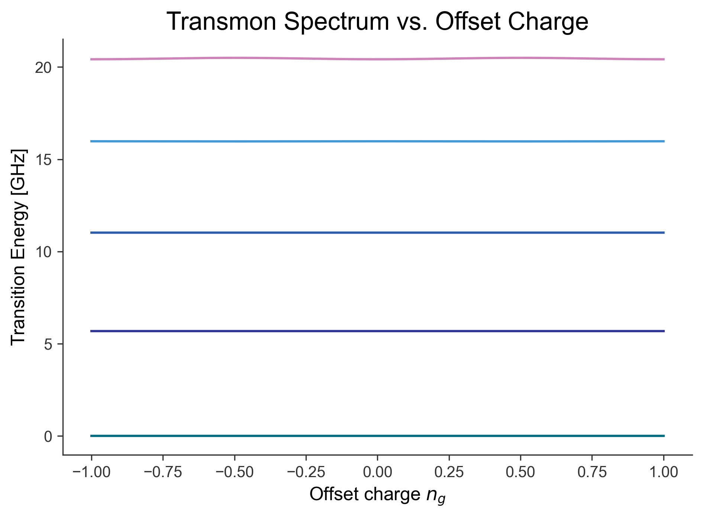
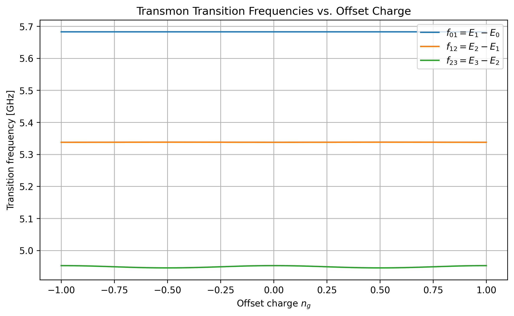
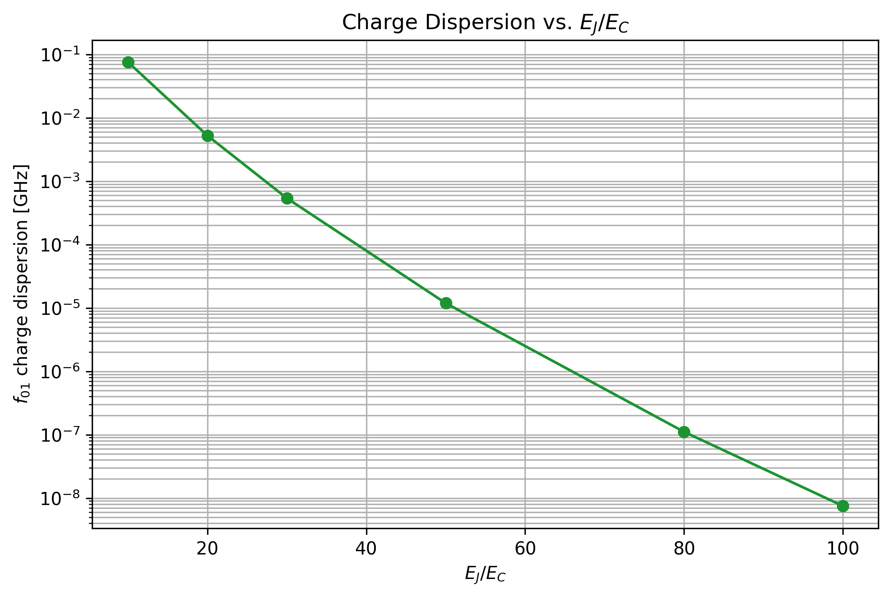
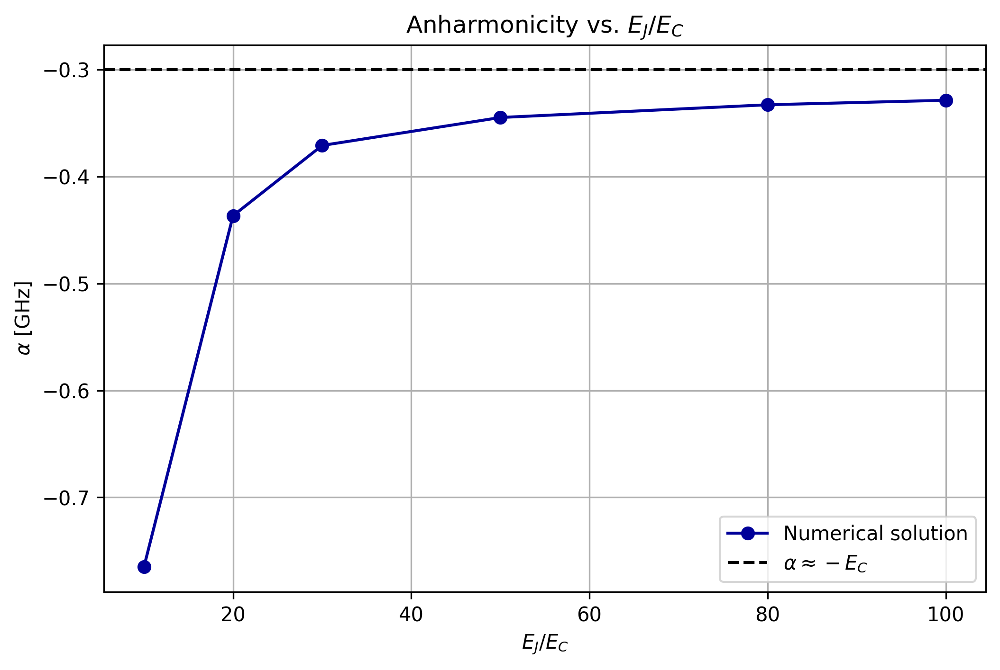
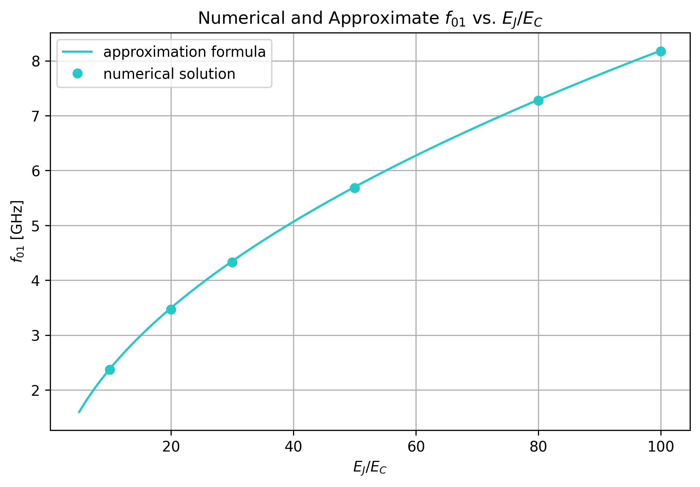
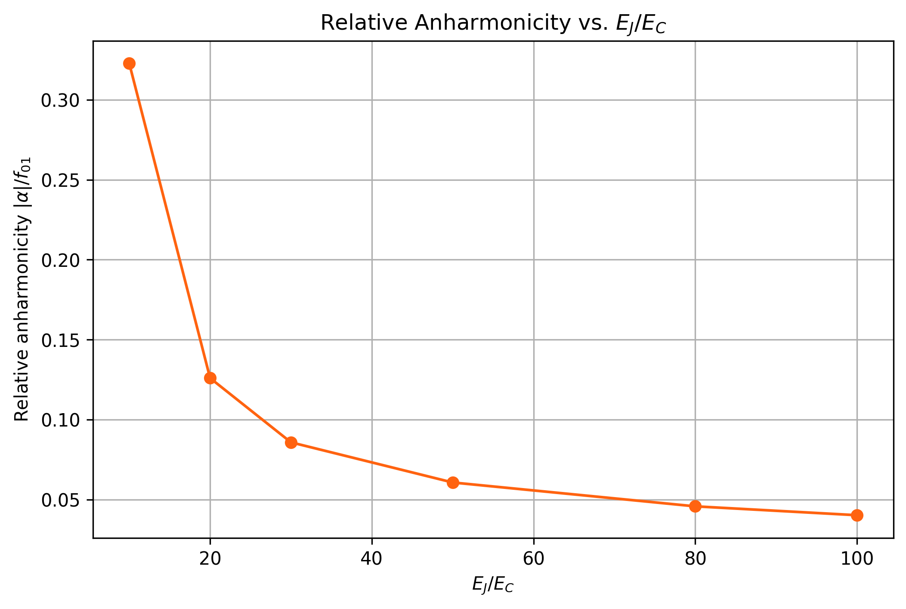

# Transmon Energy Spectrum Study

This project numerically investigates the energy spectrum, transition frequencies, charge dispersion, and anharmonicity of a transmon qubit using Python and `scqubits`.

The main objective is to study how the ratio $E_J/E_C$ affects charge-noise sensitivity, transition frequency, and anharmonicity.

---

## Physical Model

A transmon is a superconducting qubit consisting of a Josephson junction shunted by a large capacitance.

Its Hamiltonian is

$$\hat{H}=4E_C(\hat{n}-n_g)^2-E_J\cos(\hat{\phi}).$$

The physical quantities are:

- $E_C$: charging energy
- $E_J$: Josephson energy
- $n_g$: offset charge
- $\hat{n}$: Cooper-pair number operator
- $\hat{\phi}$: superconducting phase operator

The phase and Cooper-pair number operators are conjugate variables satisfying

$$[\hat{\phi},\hat{n}]=i.$$

The charging-energy term is

$$\hat{H}_C=4E_C(\hat{n}-n_g)^2,$$

while the Josephson-energy term is

$$\hat{H}_J=-E_J\cos(\hat{\phi}).$$

The charging term tends to localize the system in the charge basis, whereas the Josephson term mixes neighboring charge states.

---

## Hamiltonian in the Charge Basis

The transmon Hamiltonian can be represented using charge states

$$\{\lvert n\rangle\}.$$

In this basis, the Hamiltonian matrix elements are

$$\langle n'\vert\hat{H}\vert n\rangle=4E_C(n-n_g)^2\delta_{n'n}-\frac{E_J}{2}\left(\delta_{n',n+1}+\delta_{n',n-1}\right).$$

The charging-energy contribution is diagonal:

$$\langle n'\vert\hat{H}_C\vert n\rangle=4E_C(n-n_g)^2\delta_{n'n}.$$

The Josephson contribution is off-diagonal:

$$\langle n'\vert\hat{H}_J\vert n\rangle=-\frac{E_J}{2}\left(\delta_{n',n+1}+\delta_{n',n-1}\right).$$

Therefore, the Josephson term couples neighboring charge states:

$$\lvert n\rangle\longleftrightarrow\lvert n+1\rangle.$$

In the numerical calculation, the charge basis is truncated to a finite range:

$$n=-N_{\mathrm{cut}},\ldots,N_{\mathrm{cut}}.$$

The resulting Hamiltonian matrix has dimension

$$2N_{\mathrm{cut}}+1.$$

---

## Numerical Validation

A charge-basis Hamiltonian was constructed manually and diagonalized
using NumPy. Its lowest eigenenergies were compared with the results
from `scqubits`, confirming that both methods produce consistent
low-energy spectra.

---

## Energy Levels and Transition Frequencies

After diagonalizing the Hamiltonian, the eigenenvalue equation is

$$\hat{H}\lvert k\rangle=E_k\lvert k\rangle.$$

The calculated eigenergies are

$$E_0,E_1,E_2,\ldots$$

The ground-state energy can be subtracted from every level:

$$E_k^{\mathrm{relative}}=E_k-E_0.$$

Therefore,

$$E_0^{\mathrm{relative}}=0.$$

The first transition frequency is

$$f_{01}=\frac{E_1-E_0}{h}.$$

The second transition frequency is

$$f_{12}=\frac{E_2-E_1}{h}.$$

The anharmonicity is defined as

$$\alpha=f_{12}-f_{01}.$$

For a transmon, the anharmonicity is normally negative:

$$\alpha<0.$$

This means that the $1\rightarrow2$ transition frequency is lower than the $0\rightarrow1$ transition frequency.

---

## Large-Ratio Approximation

The transmon regime corresponds to

$$\frac{E_J}{E_C}\gg1.$$

In this regime, the Josephson potential can be expanded near its minimum:

$$-E_J\cos(\phi)\approx-E_J+\frac{E_J}{2}\phi^2-\frac{E_J}{24}\phi^4+\cdots.$$

The quadratic term produces an approximately harmonic spectrum, while the quartic term produces weak anharmonicity.

The approximate energy levels are

$$E_m\approx-E_J+\sqrt{8E_JE_C}\left(m+\frac{1}{2}\right)-\frac{E_C}{12}\left(6m^2+6m+3\right).$$

The lowest transition frequency is approximately

$$f_{01}\approx\frac{\sqrt{8E_JE_C}-E_C}{h}.$$

The next transition frequency is approximately

$$f_{12}\approx\frac{\sqrt{8E_JE_C}-2E_C}{h}.$$

Therefore, the anharmonicity is approximately

$$\alpha\approx-\frac{E_C}{h}.$$

In `scqubits`, $E_C$ and $E_J$ are entered directly in frequency units such as GHz. Under this convention, the corresponding formulas become

$$f_{01}\approx\sqrt{8E_JE_C}-E_C,$$

$$f_{12}\approx\sqrt{8E_JE_C}-2E_C,$$

and

$$\alpha\approx-E_C.$$

---

## Parameters

| Parameter | Code variable | Value |
|---|---|---:|
| Charging energy | `EC` | 0.3 GHz |
| Josephson energy | `EJ` | 15.0 GHz |
| Default energy ratio | `EJ / EC` | 50 |
| Offset-charge range | `ng_values` | -1 to 1 |
| Charge-basis cutoff | `N_cut` | 15 |
| Number of energy levels | `num_levels` | 5 |

The default energy ratio is

$$\frac{E_J}{E_C}=\frac{15.0}{0.3}=50.$$

The ratio $E_J/E_C$ is also scanned over a wider range to study the transition from a charge-sensitive regime to the transmon regime.

---

## Numerical Procedure

The numerical calculation follows these steps:

1. Define the transmon parameters.
2. Construct a transmon object using `scqubits`.
3. Sweep the offset charge $n_g$ from $-1$ to $1$.
4. Diagonalize the Hamiltonian at every value of $n_g$.
5. Store the eigenenergies in an energy table.
6. Calculate $f_{01}$, $f_{12}$, and the anharmonicity.
7. Calculate the charge dispersion.
8. Repeat the calculation for different values of $E_J/E_C$.
9. Compare the numerical results with analytical approximations.
10. Save all figures in the `figures` folder.

The energy table has the structure

```text
(number of parameter values, number of energy levels)
```

Each row corresponds to one value of $n_g$, and each column corresponds to one energy level.

---

## Results

### 1. Energy Spectrum versus Offset Charge



This figure shows the lowest transmon energy levels as functions of the offset charge $n_g$.

The plotted energies are measured relative to the ground-state energy:

$$E_k^{\mathrm{relative}}(n_g)=E_k(n_g)-E_0(n_g).$$

At small $E_J/E_C$, the energy levels depend strongly on $n_g$.

At large $E_J/E_C$, the energy bands become nearly flat. This means that the transmon becomes less sensitive to offset-charge fluctuations.

---

### 2. Transition Frequencies versus Offset Charge



The first two transition frequencies are calculated from the energy table:

$$f_{01}(n_g)=E_1(n_g)-E_0(n_g),$$

and

$$f_{12}(n_g)=E_2(n_g)-E_1(n_g).$$

Because the energies returned by `scqubits` are expressed in GHz, these energy differences are also reported directly in GHz.

The difference between the transition frequencies demonstrates the anharmonic energy structure of the transmon:

$$f_{12}\neq f_{01}.$$

This non-equally-spaced spectrum makes it possible to selectively use the two lowest levels as a qubit.

---

### 3. Charge Dispersion versus Energy Ratio



The charge dispersion of an individual energy level is defined as the difference between its maximum and minimum energies over the offset-charge range:

$$\epsilon_m=\max_{n_g}\left[E_m(n_g)\right]-\min_{n_g}\left[E_m(n_g)\right].$$

For qubit operation, the more relevant quantity is the charge dispersion of the $0\rightarrow1$ transition:

$$\epsilon_{01}=\max_{n_g}\left[f_{01}(n_g)\right]-\min_{n_g}\left[f_{01}(n_g)\right].$$

In NumPy, this quantity is calculated using

```python
charge_dispersion_01 = np.ptp(f01_vs_ng)
```

As $E_J/E_C$ increases, the charge dispersion decreases exponentially.

Therefore, operating at a large value of $E_J/E_C$ strongly suppresses the transmon's sensitivity to charge noise.

---

### 4. Anharmonicity versus Energy Ratio



The anharmonicity is calculated using

$$\alpha=f_{12}-f_{01}.$$

In the large-ratio transmon regime,

$$\alpha\approx-E_C.$$

For the parameters used in this project,

$$E_C=0.3\ \mathrm{GHz}.$$

Therefore, the expected anharmonicity is approximately

$$\alpha\approx-0.3\ \mathrm{GHz}.$$

The negative sign indicates that the $1\rightarrow2$ transition frequency is lower than the $0\rightarrow1$ transition frequency.

A nonzero anharmonicity is essential because a perfectly harmonic system would have

$$f_{01}=f_{12}=f_{23}=\cdots$$

and a microwave pulse could not selectively address only the two lowest levels.

---

### 5. Numerical and Approximate Transition Frequencies



The numerical transition frequency is obtained by diagonalizing the complete transmon Hamiltonian:

$$f_{01}^{\mathrm{num}}=E_1-E_0.$$

The analytical approximation is

$$f_{01}^{\mathrm{approx}}=\sqrt{8E_JE_C}-E_C.$$

The approximation is derived by expanding the Josephson potential near its minimum and treating the quartic term as a perturbation.

At small $E_J/E_C$, the approximation is less accurate because the phase fluctuations are not sufficiently localized near the potential minimum.

As $E_J/E_C$ increases, the approximation becomes more accurate because the system moves deeper into the transmon regime.

---

### 6. Relative Anharmonicity versus Energy Ratio



The relative anharmonicity is defined as

$$\alpha_{\mathrm{rel}}=\frac{\lvert\alpha\rvert}{f_{01}}.$$

The absolute anharmonicity remains approximately determined by $E_C$:

$$\lvert\alpha\rvert\approx E_C.$$

Meanwhile, the transition frequency increases approximately as

$$f_{01}\sim\sqrt{8E_JE_C}.$$

Therefore, increasing $E_J/E_C$ causes the relative anharmonicity to decrease.

A smaller relative anharmonicity reduces the spectral separation between neighboring transitions relative to the qubit frequency.

This makes it more difficult to drive the $0\rightarrow1$ transition without also exciting the $1\rightarrow2$ transition.

---

## Physical Interpretation

Increasing $E_J/E_C$ produces both an advantage and a tradeoff.

### Advantage: Reduced Charge-Noise Sensitivity

The charge dispersion decreases rapidly:

$$\epsilon_{01}\rightarrow0.$$

Consequently, fluctuations in the offset charge produce smaller fluctuations in the qubit transition frequency.

This improves the robustness of the transmon against charge noise.

### Tradeoff: Reduced Relative Anharmonicity

The relative anharmonicity decreases:

$$\frac{\lvert\alpha\rvert}{f_{01}}\rightarrow\text{a smaller value}.$$

When the relative anharmonicity is small, a fast microwave pulse may have enough bandwidth to excite the $1\rightarrow2$ transition.

This can cause leakage from the computational subspace formed by the states $\lvert0\rangle$ and $\lvert1\rangle$.

---

## Main Conclusion

Increasing $E_J/E_C$ exponentially suppresses charge dispersion and reduces the transmon's sensitivity to charge noise.

However, increasing $E_J/E_C$ also reduces the relative anharmonicity:

$$\alpha_{\mathrm{rel}}=\frac{\lvert\alpha\rvert}{f_{01}}.$$

A smaller relative anharmonicity makes leakage into higher energy levels more difficult to control during fast gate operations.

Therefore, choosing $E_J/E_C$ requires a compromise between:

- low sensitivity to charge noise;
- sufficient anharmonicity;
- good transition selectivity;
- fast qubit control;
- low leakage error.

---

## Installation

Clone the repository:

```bash
git clone https://github.com/EnochChuang/Transmon-Energy-Spectrum-Study.git
```

Enter the project folder:

```bash
cd Transmon-Energy-Spectrum-Study
```

Install the required Python packages:

```bash
pip install -r requirements.txt
```

The main dependencies are:

- NumPy
- Matplotlib
- scqubits

---

## Usage

Run the simulation with

```bash
python "1. Transmon Energy Spectrum.py"
```

The program calculates the transmon spectrum and saves the six result figures in the `figures` folder.

---
